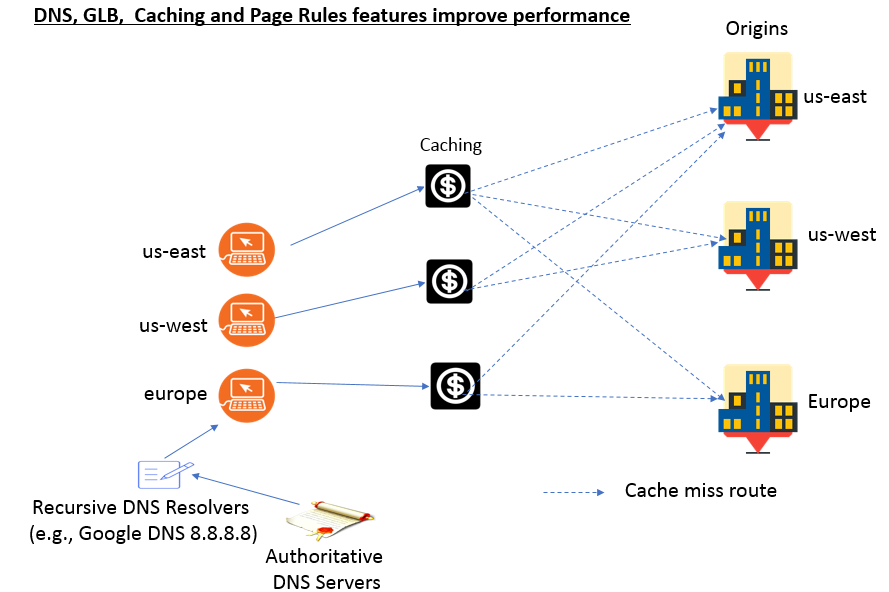

---
copyright:
  years: 2018
lastupdated: "2018-03-16"
---

{:shortdesc: .shortdesc}
{:new_window: target="_blank"}

# How IBM Cloud Internet Services (CIS) optimizes performance

IBM Cloud Internet Services (CIS) helps you improve performance of your web services and applications by leveraging three major features: Global Load Balancing, Content Optimization through Page Rules, and Caching. Superior web performance requires more than just moving static files closer to visitors; it means you must be sure that every page renders as quickly and efficiently as possible. By protecting your origin servers from spammers, bots, and malicious crawlers, you can protect your origin’s resources for your application's performance, which improves your customer experience.

Here’s a quick feature overview:

## Performance features

 * Global Load Balancing 
 * Page Rules that fine-tune your cache behavior and create content optimization
 * Caching

## Summary

 * With Global Load Balancing, your customers receive data from your closest origin servers, thereby reducing latency and improving your customer's experience.
 * With Caching and Page Rules settings, you can enhance the performance of your web services and applications.
