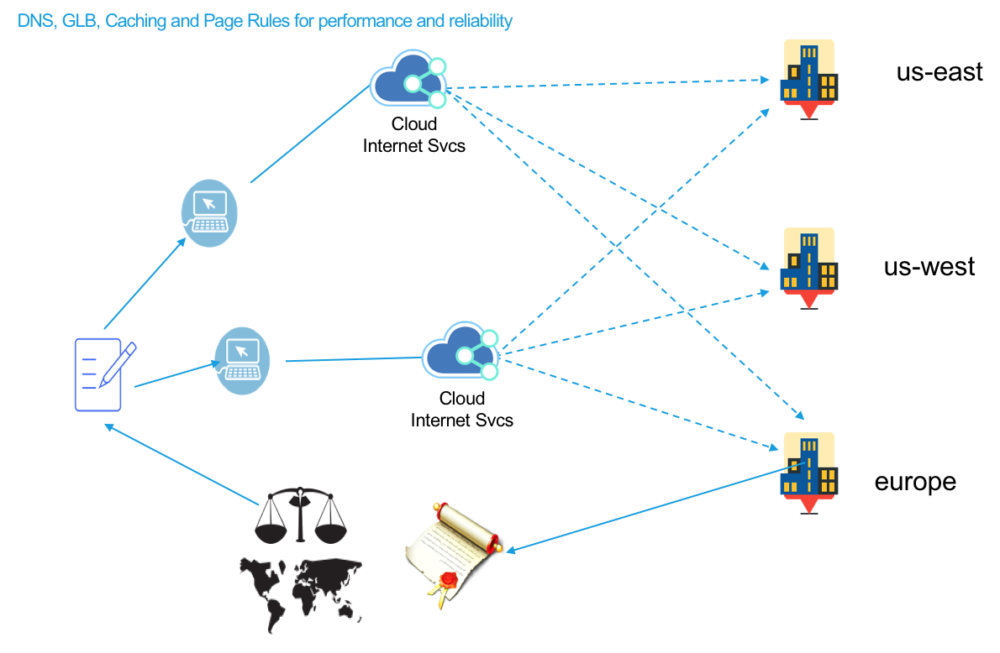

---

copyright:
  years: 2018, 2020
lastupdated: "2020-06-10"

keywords: performance IBM Cloud Internet Services, IBM Cloud Internet Services, major features

subcollection: cis

---

{:shortdesc: .shortdesc}
{:new_window: target="_blank"}
{:codeblock: .codeblock}
{:pre: .pre}
{:screen: .screen}
{:term: .term}
{:tip: .tip}
{:note: .note}
{:important: .important}
{:deprecated: .deprecated}
{:external: target="_blank" .external}
{:generic: data-hd-programlang="generic"}
{:download: .download}
{:DomainName: data-hd-keyref="DomainName"}

# How {{site.data.keyword.cis_full_notm}} optimizes performance
{:#how-cis-optimizes-performance}

{{site.data.keyword.cis_full}} ({{site.data.keyword.cis_short_notm}}) helps you improve performance of your web services and applications by leveraging three major features: Caching, Content Optimization through Page Rules, and Routing. Superior web performance requires more than just moving static files closer to visitors; it means you must be sure that every page renders as quickly and efficiently as possible. By protecting your origin servers from spammers, bots, and malicious crawlers, you can protect your origin’s resources for your application's performance, which improves your customer experience.
{: shortdesc}

## Performance features
{:#cis-performance-features}

 * Caching: Control how {{site.data.keyword.cis_short_notm}} manages your cached assets.
 * Page Rules: Fine-tune your cache behavior and create content optimization.
 * Routing: Eliminate excess latency by analyzing and optimizing routing decisions across the global Internet using real-time network connections.
 * Advanced performance: Apply Brotli compression and restrict upload sizes.

## Summary
{:#cis-performance-features-summary}

 * With Routing, your customers receive data from the optimal route, thereby reducing latency and improving your customer's experience.
 * With Caching and Page Rules settings, you can enhance the performance of your web services and applications.
