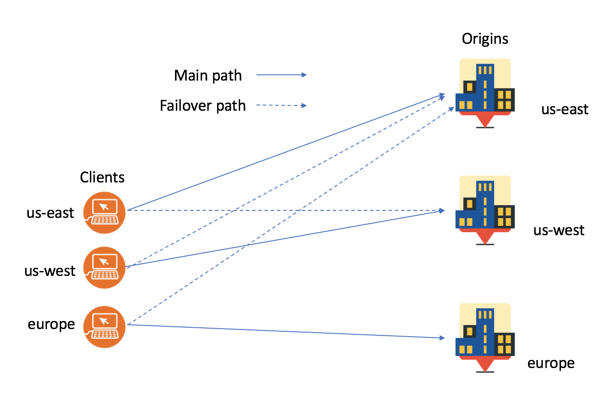

---
copyright:
  years: 2018
lastupdated: "2018-03-06"
---

{:shortdesc: .shortdesc}
{:new_window: target="_blank"}

# How IBM Cloud Internet Services (CIS) keeps your work reliable

IBM Cloud Internet Services (CIS) helps you improve the reliability of your web services and applications, because it helps you avoid downtime caused by application and infrastructure outages. For example, with Global Load Balancing, you can deploy your web services and applications in multiple regions. IBM CIS routes your customer requests to the closest regions available when Global Load Balancing is enabled. If any region fails, the requests are routed to the next closest location, so that your customers are not affected by downtime. If your website or API fails, IBM CIS sends you notifications automatically, and it notifies you when it is restored.

Here’s a quick feature overview:

## Reliability features

 * Global load balancing 
 * Proxy and non-proxy options for load balancing
 * Origin pools and health monitors
 * DNS management
 
 ### Summary
 
  * Health monitors check whether your origin pools are healthy.
  * In case of health monitor failure, your requests are re-routed to healthy origins.
  * You stay informed when your web service or API fails and when it is restored.
