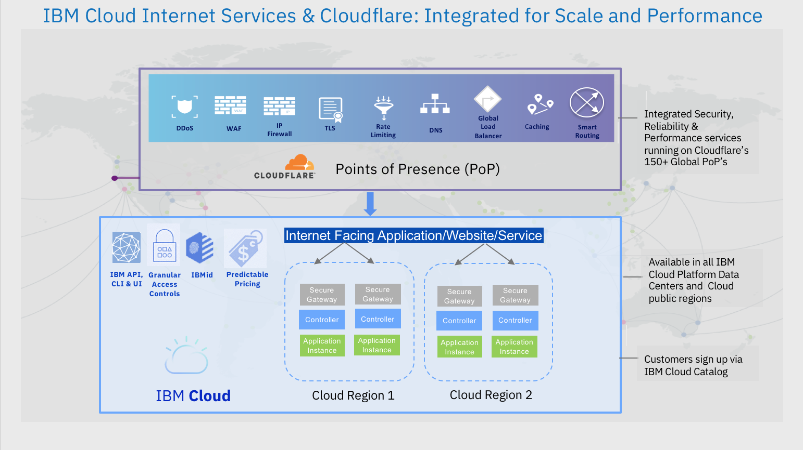

---
copyright:
  years: 2018
lastupdated: "2018-08-22"
---

{:shortdesc: .shortdesc}
{:new_window: target="_blank"}

# How IBM Cloud Internet Services (CIS) keeps your work secure

IBM CIS is a globally distributed cloud service that blocks threats and limits abusive bots and crawlers, which can waste your bandwidth and server resources. IBM CIS works as a global HTTP(S) reverse proxy and a managed DNS service provider. Your web traffic is routed through our intelligent global network to optimize both your performance and your security.

Here’s a quick feature overview:

## Security features
 * Proxy [DNS records](dns-concepts.html#proxying-dns-records) or [GLB](glb.html) to use security features. This allows traffic to flow through our servers and the data can be monitored.
### Web Application Firewall (WAF)
 * WAF is implemented through two rule sets: [OWASP](waf-owasp-ruleset.html) and [CIS](waf-cis-ruleset.html).
### Unlimited DDoS mitigation
 * DDoS mitigation is typically an expensive service that can grow in cost when under attack. We include unlimited DDoS mitigation with CIS at no additonal cost.

## Security Standards and platform

 * TLS (SHA2 and SHA1)
 * IPv6
 * HTTP/2 and SPDY

## DNS

 * Global anycast network
 * DNSSEC

## Network attacks and mitigation

Generally, we see attacks that fall into two categories

| Layer 3 or Layer 4 attacks | Layer 7 attacks |
|------------------------------|-----------------|
|These attacks consist of a flood of traffic at ISO Layer 3 (the network layer), such as ICMP floods) or at Layer 4 (the transport layer), such as TCP SYN floods or reflected UDP floods) |These are attacks that send malicious ISO Layer 7 requests (the application layer), such as GET floods.  |
| Automatically blocked at our edge | We handle these with “Defense Mode,” WAF, and Security level settings |

## IP Firewall

IBM Cloud Internet Services offers several tools for controlling your traffic so that you protect your domains, URLs, and directories against volumes of traffic, certain groups of requesters, and particular requesting IPs. This section details the tools available.

### IP Rules
The IP Rules allow you to control access for specific IP addresses, IP ranges, specific countries, specific ASNs, and certain CIDR blocks. Available actions on incoming requests are:
  * Whitelist 
  * Block 
  * Challenge (Captcha) 
  * JavaScript Challenge (IUAM challenge)

For example, if you notice that a particular IP is causing malicious requests, you can block that user by IP address.

### User-Agent Blocking Rules
User-Agent Blocking rules allow you to take action on any User-Agent string you select. This capability works like Domain Lockdown as described previously, except the block examines the incoming User-Agent string rather than the IP. You can choose how to handle a matching request with the same list of actions as you have estabilshed in the IP Rules (Block, Challenge, and JS Challenge). Note that User-Agent blocking applies to your entire zone. You cannot specify sub-domains in the same manner you can Domain Lockdowns.

This tool is useful for blocking any User-Agent strings that you deem suspicious. 

### Domain Lockdown
Domain Lockdown allows you whitelist specific IP addresses and IP ranges such that all other IPs are blacklisted. Domain Lockdown supports:

  * Specific sub-domains. For example, you can allow IP `1.2.3.4` access to the domain `foo.example.com` and allow IP `5.6.7.8` access to domain `bar.example.com`, without necessarily allowing the reverse.
  * Specific URLs. For example, you can allow IP `1.2.3.4` access to directory `example.com/foo/*` and allow IP `5.6.7.8`  access to directory `example.com/bar/*`, but not necessarily allow the reverse.
This capability is useful when you need more granularity in your access rules because, with the IP Rules, you can either apply the block to all sub-domains of the current domain, or all domains on your account, and you cannot specify URIs.

